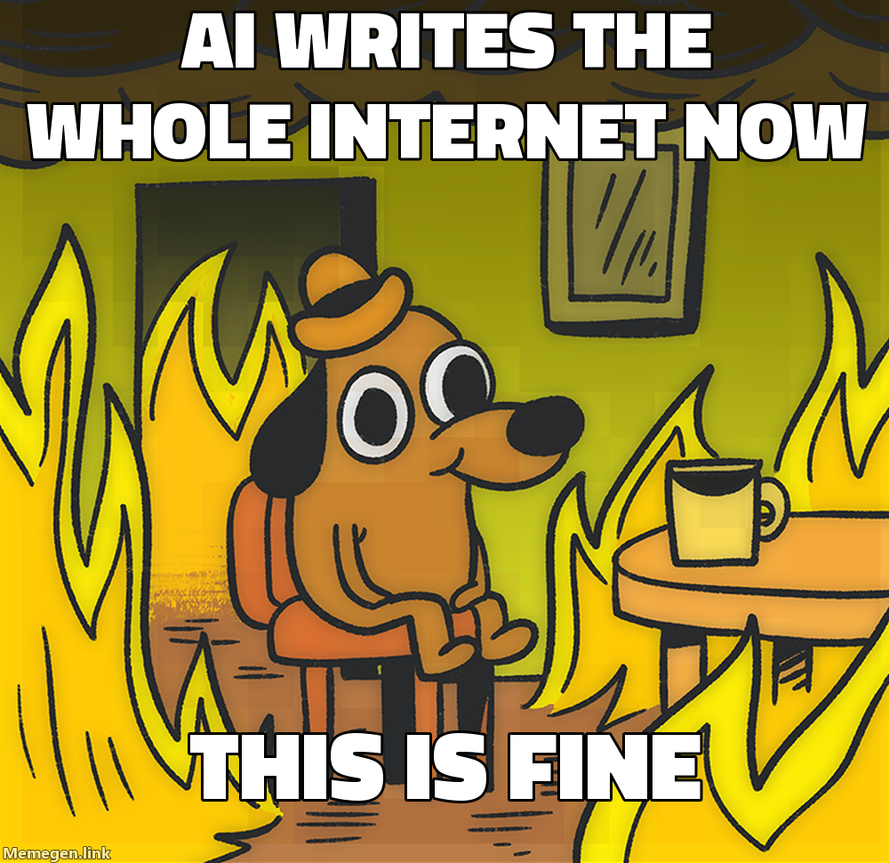

Every blog is legally required to open with a post called "hello world," so
here we are. Welcome to **Slopwatch**.

The premise is simple. The open web is being filled, at industrial speed, with
two things: slop that a machine wrote and nobody read, and breathless posts
from people announcing that the machine is alive, lucrative, and the only
thing that matters now. This is the logbook for both.

That is roughly the current mood of the internet, and roughly the job
description here. We screenshot it, label the crime, and name who posted it.

## The rules

1. **Catch it.** Screenshots, links, receipts.
2. **Label it.** Slop, or hype, and what gave it away.
3. **Blame it.** Somebody shipped this. Somebody got paid.

We are not anti-AI. We are anti-_lazy_ and anti-_grift_. Using a tool well is
fine. Bolting a firehose to the open web and calling it thought leadership is
not.

New sightings land in the [index](/). The [RSS feed](/feed.xml) exists because
of course it does. Bring receipts.
